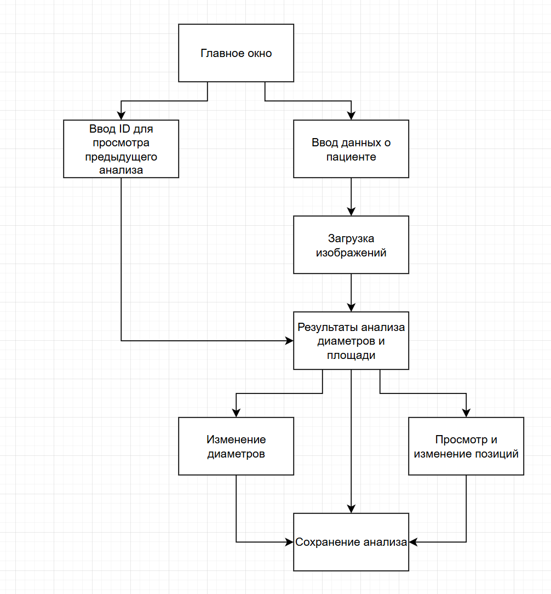

### Руководство пользователя
Для запуска приложения необходимо запустить файл main.exe

В главном окне пользователь может сделать анализ или просмотреть предыдущий.

##### Выполнение анализа
Для выполнения анализа пользователю необходимо:
1. Заполнить информацию: пол и возраст пациента
2. Масштаб изображения

Затем пользователь загружает МРТ-изображения в формате .jpg и .png с помощью диалогового окна.

После открывается окно с предсказанными диаметрами и рассчитанными по предсказаниям площадями.

Пользователь может изменить предсказанные диаметры вручную.

В окне просмотра позиций пользователь может изменять позиции позвоночных артерий. Для этого необходимо выбрать изменямую артерию, затем перетащить предсказанную проекцию артерии на нужное место. Также для удобства работы с изображениями был реализован слайдер прозрачности предсказанных позвоночных артерий.

##### Просмотр предыдущих анализов

Для просмотра предыдущих анализов необходимо сохранить анализ в базу данных с помощью соответствующей кнопки.

При нажатии кнопки "Просмотр предыдущих анализов" необходимо ввести уникальный номер исследования.

После этого откроется окно "Результаты аналиа".

Также пользователь может просмотреть позиции

